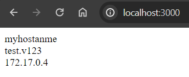
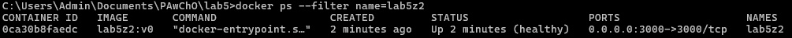
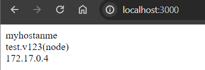

# Zadanie 1

Zawartość Dockerfile_z1:

```
FROM scratch
ARG VERSION
ENV APP_VERSION=test.${VERSION:-v0}
ADD alpine-minirootfs-3.19.1-aarch64.tar /
RUN apk up-date & apk upgrade
RUN apk add --update npm
WORKDIR /usr/app
COPY ./package.json ./
RUN npm install
COPY ./index.js ./
EXPOSE 3000
CMD [ "npm", "start" ]

```

Budowanie obrazu:

` docker build --build-arg VERSION=v123 -f Dockerfile_z1 -t lab5:v0 . `

Uruchomienie serwera:

` docker run -h=myhostanme -d --name lab5z1 -p 3000:3000 lab5:v0 `

Efekt dzialania kontenera:



# Zadanie 2

```
FROM node:alpine
ARG VERSION
ENV APP_VERSION=test.${VERSION:-v0}
RUN apk add --update curl && \
rm -rf /var/cache/apk/*
WORKDIR /usr/app
COPY ./package.json ./
RUN npm install
COPY ./index.js ./
EXPOSE 3000

HEALTHCHECK --interval=10s --timeout=1s \
  CMD curl -f http://localhost:3000/ || exit 1

CMD [ "npm","start" ]

```


Budowanie obrazu:

` docker build --build-arg VERSION=v123(node) -f Dockerfile_z2 -t lab5z2:v0 . `

Uruchamianie serwera:

` docker run -h=myhostanme -d --name lab5z2 -p 3000:3000 lab5z2:v0 `

Sprawdzenie stanu kontenera:

`docker ps --filter name=lab5z2`



Efekt dzialania kontenera:

